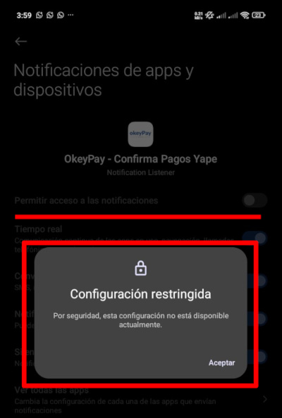

# 📲 Manual/problemas comunes al instalar [OkeyPay](http://okeypay.anibalcopitan.com/)

## Cómo GRABAR la PANTALLA de tu MÓVIL ANDROID GRATIS

## 🔧 Problemas Comunes

### 1. Desactivar Play protect

Algunas veces necesitaras desabilitar play protect para poder instalar applicacion .apk en tu celular:

**Solución en video:**

### 2. Configuración restringida (acceso a notificaciones)

Algunos modelos Xiaomi tienen particularidades.

**Solución en video:**

**Soporte Directo**

¿Tienes dudas o algo no te funciona?
Escríbenos directamente por WhatsApp 👉 [Click aquí](https://wa.me/51970142637)

